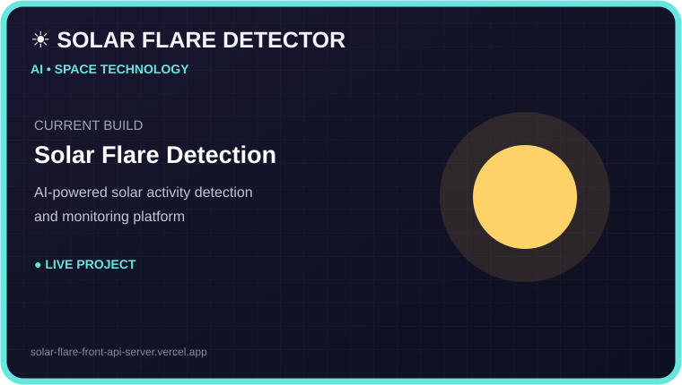
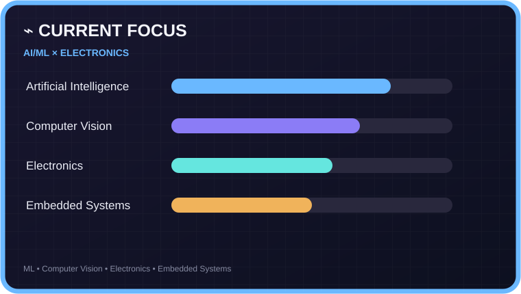
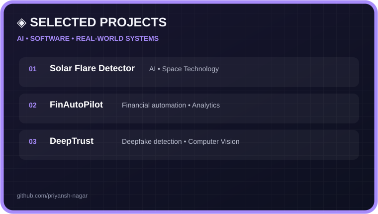
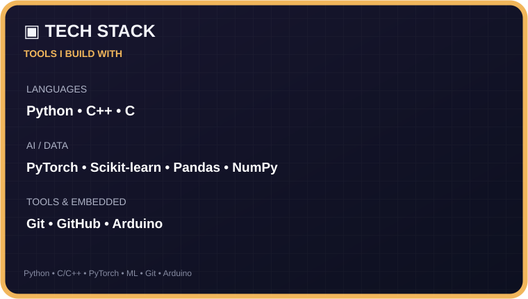

<h1 align="center">Hi 👋, I'm Priyansh Nagar</h1>
<h3 align="center">AI/ML Developer • ECE Student • Builder</h3>

---

- 🔭 I'm currently working on [Solar Flare Detector](https://solar-flare-front-api-server.vercel.app/)
- 🌱 I'm currently learning **Machine Learning, Computer Vision, Generative AI, Analog & Digital Electronics, Microcontrollers, Embedded Systems, and Communication Systems**
- 👯 I'm looking to collaborate on [AI/ML & Computer Vision Projects](https://github.com/priyansh-nagar)
- 👨‍💻 All of my projects are available at [GitHub](https://github.com/priyansh-nagar)
- 💬 Ask me about **AI/ML, Computer Vision, Python, PyTorch, Electronics, Embedded Systems, and building AI-powered applications**
- 📫 How to reach me **[priyanshnagar4120@gmail.com](mailto:priyanshnagar4120@gmail.com)**
- 📄 Know about my experiences [View Resume](https://drive.google.com/file/d/1RGP7SivMXv_-vLiYWu1rNW3PuxrczWpz/view?usp=sharing)
- ⚡ Fun fact **I turn random ideas into projects and somehow end up deploying them. 🚀**

---

<h3 align="left">Connect with me:</h3>

---

---

<h3 align="left">Languages and Tools:</h3>

---

### BUILD → EXPERIMENT → LEARN → REPEAT 🚀

